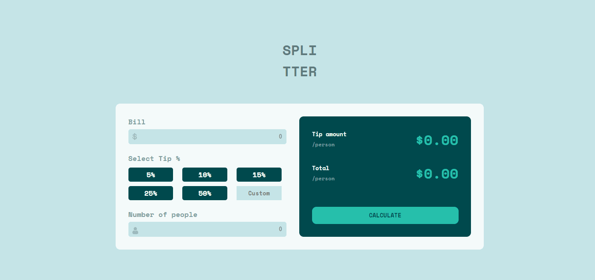
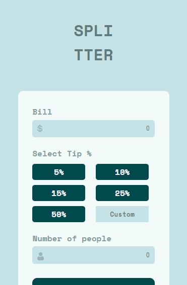

# Desafio Calculadora de Gorjeta - Frontend-Mentor

Este é um desafio de uma calculadora de gorjeta, proposto pelo site Frontend-Mentor.

## Tabela de Conteúdos

- [Visão Geral](#visão-geral)
    - [Imagens](#imagens)
    - [Link da página](#link)
- [Processo](#processo)
    - [Linguagens utilizadas](#linguagens-utilizadas)
    - [O que aprendi](#o-que-aprendi)
    - [Possíveis evoluções](#possíveis-evoluções)
- [Autor](#autor)

## Visão-geral

### Imagens

<br>

````
Versão de Desktop
````

   

<br>

````
Versão Mobile
````

 

### Link

- Página no GitHub Pages: <a href="https://julio-mansan2.github.io/calculadora-de-gorjeta/">Clique aqui!</a>

## Processo

### Linguagens utilizadas

<br>

- Marcações semânticas de HTML5
- Propriedades de customização do CSS3
- Estruturas em JavaScript

<br>

### O que aprendi

<br>

- Utilizar operações matemáticas dentro do JavaScript:

````html

<input type="text" name="" oninput="this.value = this.value.replace(/[^0-9.]/g, '').replace(/(\..*?)\..*/g, '$1');" required id="bill" class="valid" placeholder="0">

<div class="radio">
    <label>
        <input type="radio" id="0.05" class="input-radio"  name="option[356]" value="0.05" required>
        <span>5%</span>
    </label>
</div>

<input type="text" class="valid" oninput="this.value = this.value.replace(/[^0-9.]/g, '').replace(/(\..*?)\..*/g, '$1');" required name="" id="people" placeholder="0">

````
````javascript

const inputBill = document.getElementById('bill')
const input5 = document.getElementById('0.05')
const inputPeople = document.getElementById('people')
const tipAmountPerson = document.querySelector('.tip-amount-person')
const total = document.querySelector('.total')
const btnReset = document.getElementById('reset')

btnReset.addEventListener('click', function () {
    event.preventDefault()
    if (input5.checked) {
        total.innerHTML = '$' + (inputBill.value / 1 + inputBill.value * input5.value) / inputPeople.value
        tipAmountPerson.innerHTML = '$' + (inputBill.value * input5.value) / inputPeople.value
    } 
}
)

````
<br>

- Permitir apenas números dentro de um input text:

````html

<input type="text" class="valid" oninput="this.value = this.value.replace(/[^0-9.]/g, '').replace(/(\..*?)\..*/g, '$1');" required name="" id="people" placeholder="0">

````

### Possíveis evoluções

<br>

- Códigos mais compactos;

<br>

## Autor

GitHub - <a href="https://github.com/julio-mansan2">julio-mansan2</a> <br>
Front-end Mentor - <a href="https://www.frontendmentor.io/profile/julio-mansan2">julio-mansan2</a> <br>
LinkedIn - <a href="https://www.linkedin.com/in/j%C3%BAlio-a-mansan-3415a7249/">Júlio A.</a> <br>